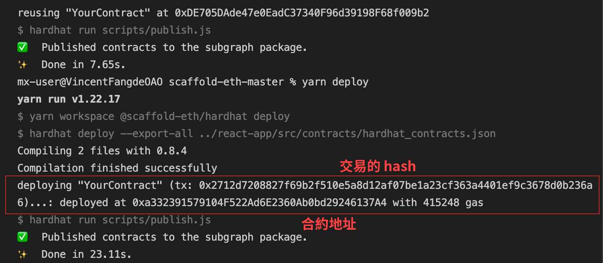

# 🏗 Scaffold-ETH

## Get Start

### 使用步驟

> 首先，安裝 scaffold-ETH，執行
```bash
cd scaffold-eth
yarn install
yarn chain // 運行私有鏈（非必要）
yarn start // 開啟前端 http://localhost:3000
```

## Development

### 開發所需的路徑

🔏 編輯合約 `YourContract.sol` in `packages/hardhat/contracts`

📝 撰寫前端 `App.jsx` in `packages/react-app/src`

💼 deployment scripts in `packages/hardhat/deploy`

### 學習 Solidity
- [Primitive Data Types](https://solidity-by-example.org/primitives/)
- [Mappings](https://solidity-by-example.org/mapping/)
- [Structs](https://solidity-by-example.org/structs/)
- [Modifiers](https://solidity-by-example.org/function-modifier/)
- [Events](https://solidity-by-example.org/events/)
- [Inheritance](https://solidity-by-example.org/inheritance/)
- [Payable](https://solidity-by-example.org/payable/)
- [Fallback](https://solidity-by-example.org/fallback/)

📧 Learn the [Solidity globals and units](https://solidity.readthedocs.io/en/v0.6.6/units-and-global-variables.html)

## Deployment

### 部署之前

以 rinkeby 為例，將自己的 Metamask 帳戶切換至 rinkeby

＊請注意，不要使用 ganache 匯入的帳戶來做這個步驟

### 需修改的檔案

packages/hardhat/example.env

> 檔名更改成 .env，根據所需的 Network 加入環境變數。以 rinkeby 為例：
  
1. Infura 節點的 Key "RINKEBY_INFURA_KEY" 
   - Metamask 點擊右上角頭像 -> 設定 -> 網路 -> 取得該網路的 Infura Key - https://rinkeby.infura.io/v3/{Your Key}
   - 或是任何一個節點，別的錢包的節點，都行。（已測試過）

2. 私鑰 "RINKEBY_DEPLOYER_PRIV_KEY" 取得方式：
   Metamask 點擊右上角三個點 -> 帳戶 -> 輸出私鑰

```bash
// 字串已修改過，僅為範例使用
# Rinkeby 
RINKEBY_INFURA_KEY=9a3d95b3bc440fa88ea12eaa44561611
RINKEBY_DEPLOYER_PRIV_KEY=eac0a2ff4d99d3fbeac67d020306dbcc515343186f4de0aa973fe2ca78cecd9f
```

packages/hardhat/hardhat-config.js

> 接續上面的過程，以 rinkeby 為例：

1. 更改 `defaultNetwork` 的值
```javascript
const defaultNetwork = "rinkeby";
```

2. 透過 .env 加入至 networks：rinkeby 的設定中
```javascript
module.exports = {
  defaultNetwork,
  // 省略 ...
  networks: {
    // 省略 ...
    rinkeby: {
      // 任何一個節點都行
      url: `https://rinkeby.infura.io/v3/${process.env.RINKEBY_INFURA_KEY}`, 
      // 自己想連結的錢包私鑰
      accounts: [`${process.env.RINKEBY_DEPLOYER_PRIV_KEY}`],
    },
    // 省略 ...
  },
  // 省略 ...
}
```

### 部署合約

> 編譯並部署合約

```bash
yarn deploy
```

* 如果是部署預設合約，Etherscan 會因為鏈上已存在一模一樣的合約而順便幫你驗證完畢

若遇到以下問題，請至 Metamask 打開 [顯示進階 Gas 控制選項]
- https://hardhat.org/errors/
- https://blockcast.it/2021/08/23/what-happened-after-the-launch-of-eip-1559/
```
HH114: Incompatible fee price parameters
```

可以至 Etherscan 查詢




## 開啟前端 React-App

### 連結到正確的鏈

前往該頁面的 .jsx，根據你想要連結的鏈更改 initialNetwork 設定：

這裡以 App.jsx 為例，路徑為 packages/react-app/src/App.jsx

```javascript
/// 📡 What chain are your contracts deployed to?
const initialNetwork = NETWORKS.rinkeby; // <------- select your target frontend network (localhost, rinkeby, xdai, mainnet)
```

### sample.env 更名為 .env
- 設定 React APP 運作的網路節點。開發過程可先略過這個，待前端需上測試或正式站時，再行設定。
- 若 App.jsx 未找到這個檔案，會自動連結 initialNetwork
```
REACT_APP_PROVIDER={節點網址}
```

---

## 開發細節

packages/react-app/
```
public/ // react dom 模板，包含 <meta>、#root 等等
src/components/ // 所有模組
src/views/ // 各分頁
src/App.jsx // 基本介面
```


